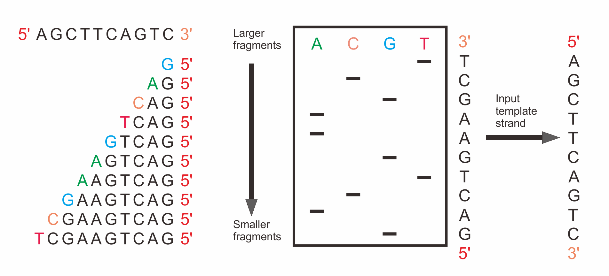
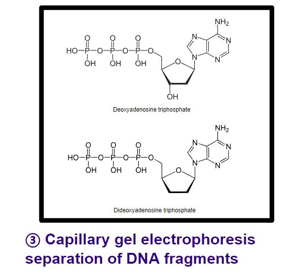
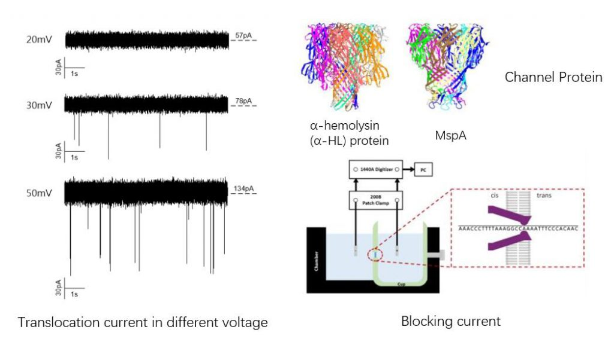

# 0.2 Sequencing technologies

DNA sequencing has become a marvel technique in molecular biology, prompted a new era of scientific life science, which allowing analysis of genes at the nucleotide level. This progress made it possible for understanding more possible mechanisms of disease \(by whole genome sequencing, exome sequencing, ctDNA, RNA-seq etc\),  other species genome \(by assembly the whole genome from short sequences\), the micro-environment around us \(by identifying different species in a mixture\) so on and so forth. 

Before we can really appreciate so many applications in this field, it's critical for us to understand how sequencing technologies work. Since DNA sequencing was first devised in 1977 by  [Frederick Sanger](https://en.wikipedia.org/wiki/Frederick_Sanger) and colleagues, sequencing methods have been evolved rapidly and volatile in sequencing object \(DNA, RNA, exome, methylation etc\). However, some of the basis and core ideas are the same which we'll try to cover in the following context.  

## First generation sequencing  - Sanger sequencing

**Sanger sequencing** is a method of [DNA sequencing](https://en.wikipedia.org/wiki/DNA_sequencing) first commercialized by [Applied Biosystems](https://en.wikipedia.org/wiki/Applied_Biosystems), based on the selective incorporation of chain-terminating [dideoxynucleotides](https://en.wikipedia.org/wiki/Dideoxynucleotide) by [DNA polymerase](https://en.wikipedia.org/wiki/DNA_polymerase) during [in vitro](https://en.wikipedia.org/wiki/In_vitro) [DNA replication](https://en.wikipedia.org/wiki/DNA_replication).[\[1\]](https://en.wikipedia.org/wiki/Sanger_sequencing#cite_note-Sanger75-1)[\[2\]](https://en.wikipedia.org/wiki/Sanger_sequencing#cite_note-Sanger1977-2). Even though it is the pioneer, fortunately it has not become the martyrs. It is still widely used in like smaller-scale projects, validation of Next-Gen results, forensic due to it's high [sequencing quality](https://en.wikipedia.org/wiki/Phred_quality_score) and long reads length \( around 1000bp compared to 200bp of Next generation sequencing\). 

 There are two keys to understand how Sanger sequencing works: 1\) we can read all base pairs before some specific characters from the start of that sequence.  2\) we have very high resolution ' picture methods' that tell if one read is one base longer than the other. The next step is transforming the mechanism into pictorial framework. 

The figure conveys two information, one is that Sanger sequencing get the whole sequence by reading only one base at a time, the second is that we have a way to dye so that we can distinguish four base. With the _ladder_  like result, we can read from the top down \( more accurately, from the short to long \).  But wait, this is only an illustration, how did it works? like why could it stops at each base increment and how they dyed and read from the tags?

Let's first answer why it can stop at one base increment each time. Sanger Sequencing utilizes 2',3'-dideoxynucleotide triphospates \(ddNTPs\), molecules that differ from deoxynucleotides \(dNTP\) by the having a hydrogen atom attached to the 3' carbon rather than an OH group. \(Figure 2\). These molecules terminate DNA chain elongation because they cannot form a phosphodiester bond with the next deoxynucleotide \( Elizabeth Canfield '99\). 

Once we know how to stop we should also know how to continue. Notice that the mixture you'll put into a [SDS-PAGE](https://en.wikipedia.org/wiki/SDS-PAGE) \(sodium dodecyl sulfate–polyacrylamide gel electrophoresis which has a resolution at **one base**\) is a hotpot of things. Basically reads with all lengths, primers, enzymes, dNTP and ddNTP. When you begin your experiment,  the concentration of ddATP should be around 1% of the concentration of dATP. The logic behind this ratio is that after DNA polymerase is added, the polymerization will take place and will terminate whenever a ddATP is incorporated into the growing strand. If the ddATP is only 1% of the total concentration of dATP, a whole series of labeled strands will result \(which means only a small proportion of synthetic reads will stop due to discontinuity of ddNTP \). Note that the lengths of these strands are dependent on the location of the base relative to the 5' end. 

You can finally read the sequence out from the gel as showed in Figure1. The principle of gel electrophoresis has been introduced in previous chapter.

An improvement of traditional sanger sequencing can be seen [\[3\]](https://en.wikipedia.org/wiki/Sanger_sequencing). 

In general, Sanger sequencing is recommended with it's high accuracy, but it suffers from high cost, low base quality in the first 15-40 bp due to primers, limited in size, complex procedure and low throughput \(300-1k bp\). 

## Next generation sequencing

[Next-generation sequencing \(NGS\)](https://en.wikipedia.org/wiki/DNA_sequencing#High-throughput_methods), also known as high-throughput sequencing, is a groundbreaking invention in genome research. This technology has actually accelerated the Human Genome Project which can sequence the whole human genome within a day compared to a decade if you use Sanger sequencing. Based on that fast characteristic, it is the one that has been applied into routine clinical practice and labs research which really promoted the world move forward. 

The distinguished feature of NGS is high throughput, these NGS platforms can provide few million reads with length from 50bp to 300bp in a run. So how do they achieve this? We'll use illumina as an example:

### Illumina sequencing

{% embed data="{\"url\":\"https://www.youtube.com/watch?v=9YxExTSwgPM\",\"type\":\"video\",\"title\":\"Illumina Sequencing Technology\",\"icon\":{\"type\":\"icon\",\"url\":\"https://www.youtube.com/yts/img/favicon\_144-vfliLAfaB.png\",\"width\":144,\"height\":144,\"aspectRatio\":1},\"thumbnail\":{\"type\":\"thumbnail\",\"url\":\"https://i.ytimg.com/vi/9YxExTSwgPM/mqdefault.jpg\",\"width\":320,\"height\":180,\"aspectRatio\":0.5625},\"embed\":{\"type\":\"player\",\"url\":\"https://www.youtube.com/embed/9YxExTSwgPM?rel=0&showinfo=0\",\"html\":\"
<iframe src=\\\"https://www.youtube.com/embed/9YxExTSwgPM?rel=0&amp;showinfo=0\\\" style=\\\"border: 0; top: 0; left: 0; width: 100%; height: 100%; position: absolute;\\\" allowfullscreen scrolling=\\\"no\\\"></iframe>
\",\"aspectRatio\":1.7778}}" %}

This brief introduction of illumina technology is very explanatory and vivid. And next we'll summarize the major steps:

* **Step1:  Sample Preparation:**
  * DNA samples will first be fragmented into short sequence follow illumina nebulization protocol. Then ends of the DNA are polished, and two unique adapters are ligated to the fragments of length 150-200bp. After that, PCR will be carried out for amplification. Notice that in this step, the PCR is amid for increase copies of the sample fragments so that they can ligate to adapters which should be distinguish from latter step and bridge amplification.
* **Step2: Cluster Generation by Bridge Amplification:**
  *  A unique "bridged" amplification reaction that occurs on the surface of the flow cell. Flow cell surface is coated with single stranded oligonucleotides that correspond to the sequences of the adapters ligated during the sample preparation stage. This step forms the **cluster** that makes the  fluorescent signal strong enough to be detected.
* **Step3: Sequencing by Synthesis \(SBS\):**
  * After bridge amplification. The flow cell is now loaded into the sequencer for automated cycles of extension and imaging.
  * Images represent the data collected for the first base. Any signal above background identifies the physical location of a cluster \(or polony\), and the fluorescent emission identifies which of the four bases was incorporated at that position.

Besides illumina, there are a number of modern technologies in the catch-all term NGS, they include:

* Illumina \(Solexa\) sequencing
* Roche 454 sequencing
* Ion torrent: Proton / PGM sequencing
* SOLiD sequencing

<table>
  <thead>
    <tr>
      <th style="text-align:left"></th>
      <th style="text-align:center">Feature</th>
      <th style="text-align:center">SBS*</th>
      <th style="text-align:center">cost/megabase</th>
      <th style="text-align:center">Read length</th>
    </tr>
  </thead>
  <tbody>
    <tr>
      <td style="text-align:left">illumina(Solexa)</td>
      <td style="text-align:center">Bridge PCR</td>
      <td style="text-align:center">
        
Polymerase

        
(reversibleterminators)

      </td>
      <td style="text-align:center">$2</td>
      <td style="text-align:center">50-300bp</td>
    </tr>
    <tr>
      <td style="text-align:left">454</td>
      <td style="text-align:center">Emulsion PCR</td>
      <td style="text-align:center">
        
Polymerase

        
(pyrosequencing)

      </td>
      <td style="text-align:center">$60</td>
      <td style="text-align:center">250bp</td>
    </tr>
    <tr>
      <td style="text-align:left">SOLiD</td>
      <td style="text-align:center">Emulsion PCR</td>
      <td style="text-align:center">Ligase(octamerswithtwo-baseencoding)</td>
      <td style="text-align:center">$2</td>
      <td style="text-align:center">35bp</td>
    </tr>
  </tbody>
</table>This table is referred to [Jay Shendure & Hanlee Ji, Nature Biotechnology 26, 1135 - 1145 \(2008\)](https://www.nature.com/articles/nbt1486). Since the field is evolving fast, some of the information may not accurate but just for reference. 

## Third generation sequencing

One limitation of NGS methods is that the readout reads are usually short \(around 200bp or shorter\), this causes big problem when we want to use these reads to assemble a whole genome of one species. The dilemma is we have quite a lot of [repeat sequence](https://en.wikipedia.org/wiki/Repeated_sequence_%28DNA%29) in the genome.

One can get a flavor of how hard to assemble a genome when you only have short reads in hand by imaging that you're going to finish a jigsaw which is a seaside scenery.  When you look at the sky, it just purely blue without any details or traces, the shorter reads you get the smaller jigsaw you get, so that it's hard to tell where should you put that piece right? 

[Third generation sequencing ](https://en.wikipedia.org/wiki/Third-generation_sequencing)is also termed as long-read sequencing. It solves the above mentioned jigsaw dilemma by reducing the complexity of the problem through much larger piece. The read length of 3rd sequencing could up to 10kb compared to 200bp in second generation. Now, when you look at the sky pure blue area again, you would not be bother anymore since you only have maybe 2 or 3 pieces to complete the area!

So how does it work? Let's first look at a widely used method from leading 3rd sequencing company [Pacbio](https://www.pacb.com/):

{% embed data="{\"url\":\"https://www.youtube.com/watch?time\_continue=32&v=WMZmG00uhwU\",\"type\":\"video\",\"title\":\"Overview of SMRT Technology\",\"description\":\"PacBio\'s SMRT technology harnesses the natural process of DNA replication, which is a highly efficient and accurate process.  Our SMRT technology enables the observation of DNA synthesis as it occurs in real time.\",\"icon\":{\"type\":\"icon\",\"url\":\"https://www.youtube.com/yts/img/favicon\_144-vfliLAfaB.png\",\"width\":144,\"height\":144,\"aspectRatio\":1},\"thumbnail\":{\"type\":\"thumbnail\",\"url\":\"https://i.ytimg.com/vi/WMZmG00uhwU/mqdefault.jpg\",\"width\":320,\"height\":180,\"aspectRatio\":0.5625},\"embed\":{\"type\":\"player\",\"url\":\"https://www.youtube.com/embed/WMZmG00uhwU?rel=0&showinfo=0&start=32\",\"html\":\"
<iframe src=\\\"https://www.youtube.com/embed/WMZmG00uhwU?rel=0&amp;showinfo=0&amp;start=32\\\" style=\\\"border: 0; top: 0; left: 0; width: 100%; height: 100%; position: absolute;\\\" allowfullscreen scrolling=\\\"no\\\"></iframe>
\",\"aspectRatio\":1.7778}}" %}

From this video we can see that the third generation sequencing do not require DNA amplification, which can reduce some bias \(like GC content imbalance cause phases lagging\) of second generation sequencing strategies.

### Pacbio - SMRT

SMRT is short for \(Single molecule real time sequencing\). It relies on sequencing by synthesis approach and real time detection of incorporated fluorescently labeled nucleotides. Pacific Biosciences \(PacBio\) introduced this sequencing method in 2009. It differs NGS fluorescent method in that:

* It do not require molecular amplification using PCR.
* It uses zero mode waveguide \(ZMW\) technology that only activate the base near the DNA polymerase, which can reducing the background optical signal.

The **advantage** of Pacbio is:

* Long read lengths: average lengths 10 kb – 15 kb, Some reads &gt;60 kb.
* Uniform coverage: No DNA amplification;  Least GC bias.
* High Accuracy: achieved by rotated sequencing \(but cost high\).
* Simultaneous epigenetic detection: Characterize epigenome No separate sample preparation required.

The **limitations** could be:

* DNA notch with intensive light.
* Inactivation of DNA polymerase. 

### Nanopore Sequencing

Nanopore sequencing is a new technology that basically depends on DNA sequence translocation through nanometer size pores by applying an electric field and measuring physical changes. [\(Rusk N 2014\)](https://www.nature.com/articles/nmeth.3085).  

It transform the “shape variation” to “electric signal“ variation by posing the DNA go through a protein or semiconductor channel under impressed voltage. To say “shape variation”, you can understand it by imaging there is a stone in a brook, and you have a smart detector for water flow velocity or volume. Then, when the stone varies in their size and shape, the read out of the detector should change as well. Based on this information, you can go back infer what kind of stone might be in the brook.  The channel \(brook side/bank\) that may formed by a protein or silicon, the electric current is like the water flow.

However, this is kinda idealism. In real word 3rd generation sequencing, you can only lower down your expectation and ask if I could distinguish 4 base signals \(A, T, C, G\). This sounds easier right? because right now you only have to tell difference from four significant varied patterns.

Advantages and disadvantages are further discussed [here.](https://en.wikipedia.org/wiki/Nanopore_sequencing#Biological:_advantages_and_disadvantages)

