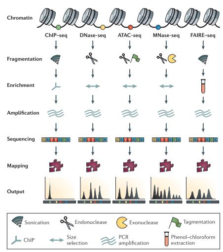

# 2.2 Primary order

## Experimental techniques for accessing primary-order Chromatin

1. Introduction
2. Selected methods for primary structure  

    2.1. ChIP-seq  

    2.2. DNase-seq  

    2.3. ATAC-seq  

    2.4. MNase-seq  

    2.5. FAIRE-seq  

3. Selected methods comparison

### 2.2.1 Introduction

The primary-order chromatin usually refers to the unpacked chromatin fiber where 11-nm coils of nucleosomes are exposed [\[1\]](https://doi.org/10.1016/j.csbj.2018.02.003). Primary structure encompasses DNA methylation and sequence features, DNA-bound factors, nucleosome position and modifications, and DNA accessibility [\[2\]](http://dx.doi.org/10.1016/j.tig.2015.03.010). Biological functions and gene expression are intimately rely on primary order structure, especially chromotin accessibility mediated by protein complexes and epigenetic modifications.

### 2.2.2 Selected methods for primary structure

[Figrue 1](http://dx.doi.org/10.1038/nrg3788):Comparison between experimental tools for primary-order structure detection. **Figure by Meyer, Clifford A.et al., Nature Reviews Genetics 15.11\(2014\):709-721.**

#### ChIP-seq

ChIP-seq [\[3\]](http://www.genome.org/cgi/doi/10.1101/gr.136184.111.) **Chromatin immunoprecipitation followed by next-generation DNA sequencing**. A method to identify DNA-associated protein-binding sites. Chromatin is fixed in cells then fragmented by sonication or MNase digestion before enrichment for the protein epitope of interest using a specific antibody. Crosslinks are reversed using proteinase K and heat and the DNA is then prepared for analysis by sequencing, array hybridization, or PCR [\[2\]](http://dx.doi.org/10.1016/j.tig.2015.03.010).

#### DNase-seq

DNase-seq [\[4\]](https://www.nature.com/articles/nmeth.1313) is a method in which **DNase I digestion** of chromatin is combined with next-generation sequencing to identify regulatory regions of the genome, including enhancers and promoters and TF footprint.DNA in isolated nuclei is digested with DNase I at a concentration that must be optimized for each experiment. A library is prepared from the digested fragments by ligation of adapters and cleavage of ~20-bp sequence tags followed by size selection of a unique library molecule size or by biochemical fractionation of fragments followed by ligation of sequencing adapters [\[2\]](http://dx.doi.org/10.1016/j.tig.2015.03.010).

#### ATAC-seq

ATAC-seq [\[5\]](https://www.ncbi.nlm.nih.gov/pubmed/24097267) **Assay for transposase- accessible chromatin using sequencing**. A method that combines next-generation sequencing with in vitro transposition of sequencing adapters into native chromatin.**Tn5 transposase** is used to transpose sequencing adapter oligos into the gDNA of permeabilized, unfixed cells. The resulting library is then purified and sequenced.

#### MNase-seq

Nucleosome-associated DNA is particularly insensitive to digestion by **micrococcal nuclease \(MNase\)**. With this feature, MNase-seq [\[6\]](https://doi.org/10.1016/j.cell.2007.05.009) [\[7\]](https://doi.org/10.1016/j.cell.2008.02.022) [\[8\]](https://www.nature.com/articles/ng.545) is a powerful tool to study the open chromotin region. The enzyme cut the exposed DNA with sticky ends. Just like the packman shows, the enzyme will digest the helix until it reaches an obstruction，such as a nuecleosome or other proteins [\[9\]](https://doi.org/10.1038/nrg3788).

#### FAIRE-seq

FAIRE-seq [\[10\]](http://www.genome.org/cgi/doi/10.1101/gr.5533506) is **Formaldehyde-assisted isolation of regulatory elements followed by sequencing**. Nucleosome-bound DNA is crosslinked and removed by phenol–chloroform extraction and the remaining nucleosome- free DNA is analyzed by microarray or sequencing.This is a simpler assay for open chromatin than DNase-seq, although its **resolution** is somewhat lower \(around 200bp\).

### 2.2.3 Selected methods comparison

<table>
  <thead>
    <tr>
      <th style="text-align:left">Method</th>
      <th style="text-align:left">Targets</th>
      <th style="text-align:left">Resolution(bp)</th>
      <th style="text-align:left">Notes</th>
    </tr>
  </thead>
  <tbody>
    <tr>
      <td style="text-align:left">ChIP-seq</td>
      <td style="text-align:left">Mapping of DNA- bound proteins (including nucleosomes)</td>
      <td style="text-align:left">~100</td>
      <td style="text-align:left">
        <ul>
          <li><b>Higher resolution</b> than ChIP-chip</li>
          <li>Bias towards CG-rich sequence</li>
        </ul>
      </td>
    </tr>
    <tr>
      <td style="text-align:left">DNase-seq</td>
      <td style="text-align:left">Open chromatin</td>
      <td style="text-align:left">~1</td>
      <td style="text-align:left">
        <ul>
          <li><b>Detects TF footprints</b>
          </li>
          <li><b>Greater sensitivity at promoters than FAIRE-seq</b>
          </li>
        </ul>
      </td>
    </tr>
    <tr>
      <td style="text-align:left">ATAC-seq</td>
      <td style="text-align:left">
        <ul>
          <li>Open chromatin</li>
          <li>nucleosome positions</li>
          <li>TF footprints</li>
        </ul>
      </td>
      <td style="text-align:left">~1</td>
      <td style="text-align:left">
        <ul>
          <li><b>Simple, fast protocol</b>
          </li>
          <li><b>lower input requirements(1-50,000 cells)</b>
          </li>
        </ul>
      </td>
    </tr>
    <tr>
      <td style="text-align:left">MNase-seq</td>
      <td style="text-align:left">Nucleosomes
         Inferred closed regions</td>
      <td style="text-align:left">~1-10</td>
      <td style="text-align:left">
        <ul>
          <li><b>Genome-wide nucleosome core positioning</b>
          </li>
          <li>large numbers of reads for sufficient depth</li>
          <li>MNase sequence bias</li>
        </ul>
      </td>
    </tr>
    <tr>
      <td style="text-align:left">FAIRE-seq</td>
      <td style="text-align:left">Open chromatin</td>
      <td style="text-align:left">~200</td>
      <td style="text-align:left">
        <ul>
          <li><b>Simple experimental procedure</b>
          </li>
          <li>Variable crosslink efficienc</li>
          <li>lower resolution</li>
          <li>high noise-to-signal ratio</li>
        </ul>
      </td>
    </tr>
  </tbody>
</table>* Other techniques for primary-order structure detection one can refer to review [\[2\]](https://www.ncbi.nlm.nih.gov/pubmed/25887733). Comprehensive discussion for technical bias of these methods one can refer to review [\[9\]](https://www.ncbi.nlm.nih.gov/pubmed/25223782).

  

