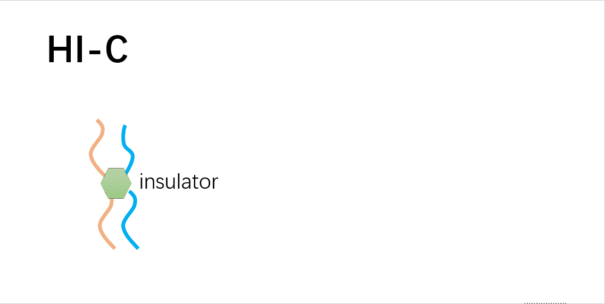

# 2.3 Higher order C-techs

## C-Techs \(chromosome conformation capture\)-coupled

1. Introduction
2. Overview of 3C-based methods

    2.1. Specificity

    2.2. Through-put and resolution

3. Hi-C
4. ChIA-PET
5. Selected methods comparison

### 2.3.1 Introduction

The foundamental object of 3C\(Chromosome Conformation Capture\) techniques and 3C-derived methods is to understand the physical wiring diagram of the genome by identifying the physical interaction between chromosomes.

To capture the interaction \(crosslink between strings\), there are few steps in general:

* Take a snapshot of the flowing cells - **Crosslink** with fixative agent \(formaldehyde\)
* Zoom in on crosslinked part and exclude untangled parts - **Digested** with a restriction enzyme
* Analyze the components come from the same chromatin - **Reverse crosslink** and **sequence**
* Finish the jigsaw puzzle and get the results - **Align** the reads and **summarize** the contacts

> Based on these general ideas, then we'll dive deeper by walking through two of the most popular techniques and then briefly introduce some other methods.

### 2.3.2 Overivew of 3C methods

 [Figure1](https://doi.org/10.1016/j.tplants.2018.03.014). Schematic Representation of Chromosome Conformation Capture \(3C\) and 3C-Derived Methods. These methods help to elucidate nuclear organization by detecting physical interactions between genetic elements located throughout the genome. Abbreviations: IP, immunoprecipitation; RE, restriction enzyme. **Figure by Sotelo-Silveira, Mariana, et al. Trends in Plant Science \(2018\).**

To better understand the difference between these methods, I'd like to distingush them between the following couple of aspects:

**1\) Specificity - What does one, all, many mean**

‘1’, ‘Many’ and ‘All’ indicate how many loci are interrogated in a given experiment. For example, ‘1 versus All’ indicates that the experiment probes the interaction profile between 1 locus and all other potential loci in the genome. ‘All versus All’ means that one can detect the interaction profiles of all loci, genome-wide, and their interactions with all other genomic loci [\[1\]](https://www.ncbi.nlm.nih.gov/pubmed/27580841).

These kind of specificity is determined by the primer when people use **specific primers** before PCR.

**2\) Through-put and resolution**

Hi-C techniques has the highest through-put \(billion reads per sample\) but suffering of a relative low resolution of 0.1-1Mb. However, the other methods usually have a higher resolution around 1kb. For more details one can refer to table2 in [\[2\]](https://www.ncbi.nlm.nih.gov/pubmed/25887733).

### 2.3.3 Hi-C

Hi-C is the highest through-put version of 3C-derived technologies. Due to the decreasing cost of 2nd generation sequencing, hi-c is widely used.

The principle of Hi-C can be illustrated as: 

**Hi-C critical steps** [**\[8\]**](https://github.com/hms-dbmi/hic-data-analysis-bootcamp/blob/master/HiC-Protocol.pptx)\*\*\*\*

* Fixation: keep DNA conformed
* Digestion: enzyme frequency and penetratin
* Fill-in: biotin for junction enrichment
* Ligation: freeze interactions in sequence
* Biotin removal: junctions only
* Fragment size: small fragments sequence better
* Adapter ligation: paired-end and indexing
* PCR: create enough material for flow cell

**Hi-C derived techniques**

* Hi-C original: [Lieberman-Aiden et al., Science 2010](doi:%2010.1126/science.1181369)
* Hi-C 1.0: [Belton-JM et al., Methods 2012](doi:%2010.1016/j.ymeth.2012.05.001)
* In situ Hi-C: [Rao et al., Cell 2014](doi:%2010.1016/j.cell.2014.11.021)
* Single cell Hi-C: [Nagano et al., Genome Biology 2015](https://doi.org/10.1186/s13059-015-0753-7)
* DNase Hi-C [Ma, Wenxiu, Methods et al](https://www.ncbi.nlm.nih.gov/pubmed/25437436)
* Hi-C 2.0: [Belaghzal et al., Methods 2017](https://www.ncbi.nlm.nih.gov/pubmed/28435001)
* DLO-Hi-C: [Lin et al., Nature Genetics 2018](https://doi.org/10.1038/s41588-018-0111-2)
* Hi-C improving: [Golloshi et al., Methods 2018](https://www.biorxiv.org/content/biorxiv/early/2018/02/13/264515.full.pdf)
* Arima 1-day Hi-C: [Ghurye et al., BioRxiv 2018](https://www.biorxiv.org/content/early/2018/02/07/261149)

### 2.3.4 ChIA-PET

ChIA-PET is another method that combines ChIP and pair-end sequencing to analysis the chromtin interaction. It allows for targeted binding factors such as: estrogen receptor alpha, CTCF-mediated loops, RNA polymerase II, and a combination of key architectural factors. on the one hand, it has the benefit of achieving a higher resolution compared to Hi-C, as only ligation products involving the immunoprecipitated molecule are sequenced, on the other hand, ChIA-PET has systematic biases due to ChIP process:

* Only one type of binding factor selected
* Different antibodies
* ChIP conditions

### 2.3.5 Selected methods comparison

| Method | Targets | Resolution | Notes |
| :--- | :--- | :--- | :--- |
| 3C [\[3\]](http://refhub.elsevier.com/S2001-0370%2817%2930093-4/rf0535) | one-vs-one | ~1–10 kb  | Sequence of bait locus must be knownEasy data analysisLow throughput |
| 4C [\[4\]](http://refhub.elsevier.com/S2001-0370%2817%2930093-4/rf0545) | one-vs-all | ~2 kb | Sequence of bait locus must be knownDetects novel contactsLong-range contacts |
| 5C [\[5\]](http://refhub.elsevier.com/S2001-0370%2817%2930093-4/rf0550) | many-vs-many | ~1 kb | High dynamic rangeComplete contact map of a locus3C with ligation-mediated amplification \(LMA\) of a ‘carbon copy’ library of oligos designed across restriction fragment junctions of interest 3C |
| Hi-C [\[6\]](http://refhub.elsevier.com/S2001-0370%2817%2930093-4/rf0300) | all-vs-all | 0.1–1 Mb | Genome-wide nucleosome core positioningRelative low resolutionHigh cost |
| ChIA-PET [\[7\]](http://refhub.elsevier.com/S0168-9525%2815%2900063-3/sbref1405) | Interaction of whole genome mediated by protein | Depends on read depth and the size of the genome region bound by the protein of interest | Lower noise with ChIPBiased method since selected protein |

