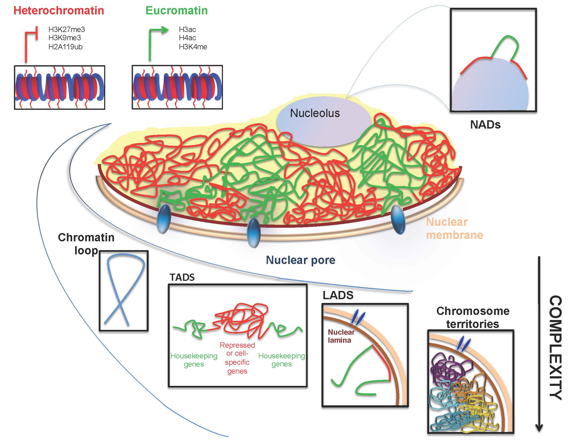
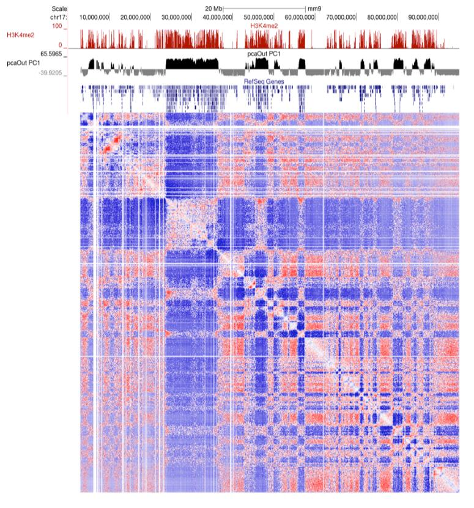
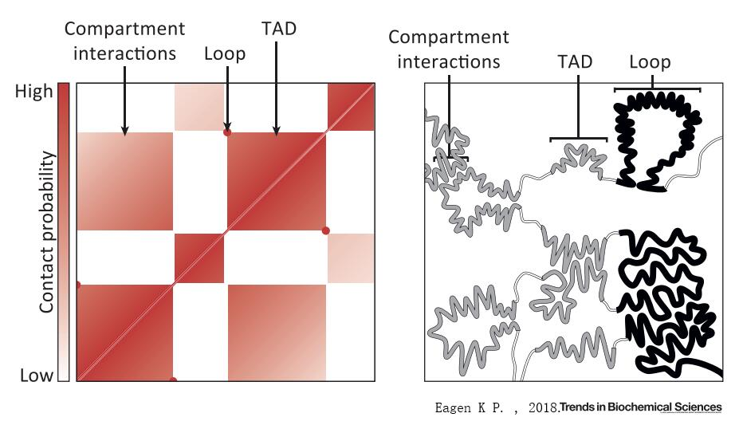
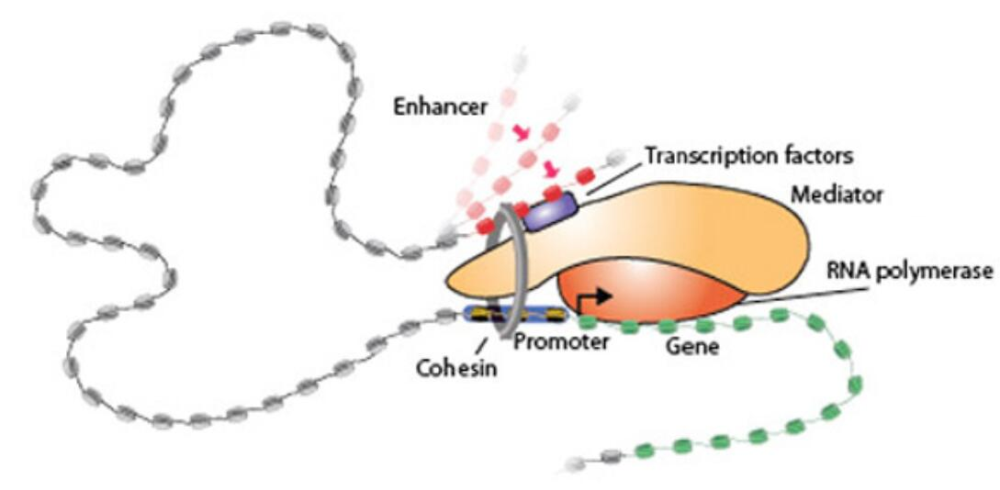

# 1.1 From 2D to 3D nuclear structure

## General features of 3D genome organization

1. 2D _cis_ elements in the genome
2. Multi-scale folding  

    2.1. Chromosome territories  

    2.2. A/B Compartments  

    2.3. TAD \(Topologically Associating Domains\)  

    2.4. Sub TAD and insulation neighborhoods  

    2.5. Chromatin loops  

3. Architectural proteins and RNAs  

    3.1. Mediator  

    3.2. Cohesin  

    3.3. CTCF  

    3.4. non-coding RNAs binding  

## 1.1 2D _cis_ elements in the genome

#### Biochemically active regulatory elements \(bound by sequence-specific regulatory TFs\) : 

* **Promoter**: The promoter is a region around the TSS \(+1\) of a gene, which contains several DNA elements that facilitate the binding of regulatory proteins. It provides a secure initial binding site for RNA polymerase and for proteins \( transcription factors \) that recruit RNA polymerase to make transcription take place [\[1\]](https://en.wikipedia.org/wiki/Promoter_%28genetics%29).
* **Enhancer**: Enhancers are CRE \(cis-regulatory elements which means they are non-coding DNA that does not code for transcription factor but engage in regulation\). They can be located up to 1M bp \(1,000,000 bp\) away from the gene, upstream or downstream from the start site [\[2\]](https://en.wikipedia.org/wiki/Enhancer_%28genetics%29).
* **Insulator**: An insulator is a genetic boundary element that blocks the interaction between enhancers and promoters. It has been found to cluster at the boundaries of topological association domains \(TADs\) and may have a role in partitioning the genome into "chromosome neighborhoods" - genomic regions within which regulation occurs [\[3\]](https://ipfs.io/ipfs/QmXoypizjW3WknFiJnKLwHCnL72vedxjQkDDP1mXWo6uco/wiki/Insulator_%28genetics%29.html).
* **Silencer**: A silencer is a DNA sequence capable of binding transcription regulation factors that block the binding of RNA polymerase to DNA sequence, thus prevent genes from being expressed as proteins [\[4\]](https://en.wikipedia.org/wiki/Silencer_%28genetics%29).

                                    Figure1. Schematic overview of regulatory elements in eukaryotes.

## 1.2 Multi-scale folding

The largest chromosomes contain hundreds of millions of base pairs that fold in a limitted space, which leads to multi-scale, hierarchical structures like: nucleosomes, chromatin fibres, chromosome domains, compartments and finally in chromosome territories.

Information resides at all levels, from the histone–DNA interactions at the sub-nucleosomal scale to the chromosome–chromosome and chromosome–lamina interactions in the nuclear space. This multi-level architecture can be regulated and/or exploited by a variety of components such as transcription factors, architectural proteins and non-coding RNAs in order to coordinate gene expression and cell fate.

With the help of currently developed chromosome capture technologies, we can see how them expanded our knowledge on chromosome structure.

 [Figure2](http://www.aimspress.com/article/10.3934/biophy.2015.4.585/figure.html). Inside the nucleus, euchromatin and heterochromatin give rise to several grades of higher order structures: chromosome loops, Topological Associated Domains \(TADs\), Lamin Associated Domains \(LADs\) and chromosomal territories. Also the nucleolus, the “assembly-chain” of ribosomes, associates with specific DNA regions: the Nucleolar Associated Domains \(NADs\), that surround the highly transcribed region of nucleolus, giving rise to another grade of chromatin organization.**Figure by Bianchi et al., AIMS Biophysics, 2015, 2\(4\): 585-612.**

### Chromosome territories

At larger scales, chromatin is organized into individual chromosome territories \(one for each chro- mosome\), which rarely intermix. This observation, initially coming from FISH studies [\[5\]](https://www.ncbi.nlm.nih.gov/pmc/articles/PMC282679/), was later validated by genome-wide Hi-C data, which showed that interactions between loci on the same chromosome are much more frequent than contacts in trans between different chromosomes [\[6\]](http://science.sciencemag.org/content/326/5950/289).

### A/B Compartments 

The Hi-C data, after normalization and converting to an observed/expected matrix, display a plaid pattern, analyzing by Principal-component analysis \(PCA\), the first principal component \(can be interpreted as the surrogate of maxim variance of the data, the most prominent feature\) contains compartments A and B \(with positive PC1 regions reflecting "active/permissive" chromatin and negative PC1 regions indicative of "inactive/inert" chromatin\).  

                                                   [Figure3](http://homer.ucsd.edu/homer/interactions/HiCpca.html). Compartment identification with PCA. **©HOMER**

### TAD \(Topologically Associating Domains\)

A topologically associating domain \(TAD\) is a self-interacting genomic region, meaning that DNA sequences within a TAD physically interact with each other more frequently than with sequences outside the TAD. These three-dimensional chromosome structures are present in animals as well as some plants, fungi, and bacteria. TADs can range in size from thousands to millions of DNA bases \([hundreds kb usually\)](https://en.wikipedia.org/wiki/Topologically_associating_domain).

TADs typically manifest as contiguous square domains along the **diagonal of Hi-C maps**. The spatial partitioning of the genome into TADs correlates with many linear genomic features such as histone modifications, coordinated gene expression, association with the lamina and DNA replication timing, enhancer–promoter interactions [\[7\]](http://dx.doi.org/10.1038/nrg.2016.112).

TAD **boundaries are enriched** for [\[8\]](https://www.nature.com/articles/nature11082)

* insulator proteins: CTCF \(detected at ~76% of all boundaries\):
* active transcription marks: H3K4me3 and H3K36me3
* nascent transcripts
* housekeeping genes \(present in ~34% of TAD boundaries\)
* repeat elements

There are also evidence to support that TADs are conserved between different cell types and across species.

* The positioning of TAD is relatively stable across cell types and appears to be independent of tissue-specific gene expression or histone modifications. During ESC differentiation, genome-wide **switching of compartments A and B occurs, whereas TAD positioning remains stable** [\[9\]](https://www.nature.com/articles/nature14222). 
* TAD positioning is **evolutionarily conserved**: 50–70% of TAD boundaries are shared between human and mouse ESCs [\[10\]](https://www.nature.com/articles/nature14222). 
* TAD is a stable **unit of replication-time regulation** [\[11\]](https://www.nature.com/articles/nature13986).

 [Figure4](https://doi.org/10.1016/j.tibs.2018.03.006). Hi-C Detected Chromatin Folding Paradigms. TADs \(more tightly folded than regions between them\) are on-diagonal boxes of contact enrichment. Loops are radially symmetric peaks of contact intensity, often located at the corners of TADs in mammalian cells. Off-diagonal boxes indicate interactions due to compartmentation. Right: TADs and loops may be either mostly transcriptionally active \(grey\) or inactive \(black\). Loops may also be more tightly folded, but additionally have an increased likelihood of contact between their boundaries or anchors. Compartmentation is indicated by homotypic \(active–active or inactive–inactive\) TAD–TAD interactions. The bona fide pattern of chromatin folding is unknown and indicated only schematically. **Figure by Eagen, Kyle P. Trends in Biochemical Sciences \(2018\).**

### Sub TAD and insulation neighborhoods

TADs can be further divided into smaller sub-TADs observed from high-resolution 5C of mouse ESCs [\[12\]](https://www.ncbi.nlm.nih.gov/pubmed/23706625). It **resembles TADs** displays the self-association feature with a decrease in contact frequency across sub-TAD boundaries, and some sub-TAD boundaries are associated with CTCF/Cohesin-mediated interactions [\[13\]](https://www.ncbi.nlm.nih.gov/pubmed/25497547). However, it differs from TADs that sub-TADs are less conserved across cell/tissue types and appear to be related to cell type–specific gene expression [\[14\]](http://journals.plos.org/plosgenetics/article?id=10.1371/journal.pgen.1004018), [\[15\]](https://www.ncbi.nlm.nih.gov/pubmed/23706625).

### Chromatin loops

It has been recognized that, cis-regulatory elements like promoter-enhancer are usually far away along the linear genome in vertebrate creatures. However, in order to elicit the regulatory effect, the genome structure evolved to form a loop that bring together two elements to a spatial proximity. This chromatin formation is usually called "chromatin loops". One well known example is the locus control region \(LCR\) of the β-globin cluster, which inter-acts strongly, via long-range chromatin contacts, with its target genes in enrythroid cells \(where the β-globin gene is active\) but shows little or no interaction in cells from different lineages[\[16\]](http://dx.doi.org/10.1038/nrg.2016.112).

### Nucleosome-nucleosome interactions

This is the smallest scale of chromatin organization. For a long time, on the basis of in vitro electron microscopy, nucleosomes were thought to form arrays \(often called the 30 nm chromatin fibres\) with either solenoid or zig-zag shapes. However, recent studies provide more evidence to stand by a more flexible, heterogeneous groups arranged structure [\[17\]](https://www.cell.com/cell/fulltext/S0092-8674%2815%2900132-4).

## 1.3 Architectural proteins and RNAs

An important question in chromatin biology is how the structural features of 3D chromatin organization are established. Few architectural proteins have shown to be essential for chromatin architecture.

             [Figure5](http://wi.mit.edu/news/archive/2010/surprise-genome-structure-linked-developmental-diseases). Schematic of architecture proteins.**©Image: Tom DiCesare/Whitehead Institute**.

### Mediator \(coactivator\)

Mediator is found at both the enhancers and the promoters of actively transcribed genes and promotes transcription by enabling pre-initiation complex \(PIC\) assembly and RNAPII elongation [\[18\]](http://dx.doi.org/10.1038/nrg.2016.112).

### Cohesin

Cohesin is protein with multiple functions:

* It regulates the separation of sister chromatids during cell division.
* It's important for DNA repair [\[19\]](https://www.ncbi.nlm.nih.gov/pubmed/19886810).
* For **chromatin architecture**: cohesin interacts with both CTCF and mediator48 and

  is proposed to be a part of the loop-extrusion complex in interphase cells [\[18\]](http://dx.doi.org/10.1038/nrg.2016.112).

### CTCF

CTCF was originally characterized as an insulator protein, capable of restricting enhancer–promoter interactions. Around 15% CTCFs are enriched at TAD boundaries in mammals, the majority lie within TADs and are thought to be involved in intra-TAD interactions [\[20\]](https://www.ncbi.nlm.nih.gov/pubmed/21685913). Another prominent feature is that CTCF sites at loop anchors occur predominantly in a convergent orientation, which suggests that not only binding but also **directionality** of binding sequence is important for the formation of a loop [\[18\]](http://dx.doi.org/10.1038/nrg.2016.112).

### Non-coding RNAs binding

One interesting observation is that both mediator and CTCF seem to be able to bind directly to RNA, and knock down some of mediator binding non-coding RNAs led to a diminished loop formation between the ncRNA locus and its targets. [\[18\]](http://dx.doi.org/10.1038/nrg.2016.112).

