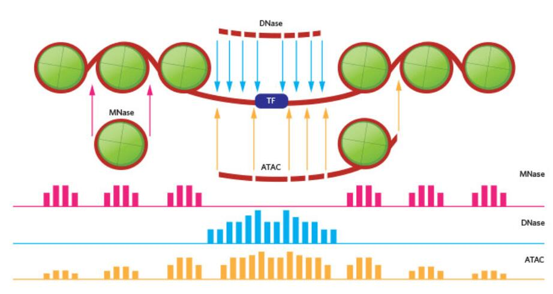

# 3.1 Primary order analysis

## Assessment of Primary-order Chromatin

1. Features of data 
2. Analytical pipeline  


    2.1. Step1 Raw reads  


    2.2. Step2 Pre-processing & Alignment  


    2.3. Step3 Peak calling  


    2.4. Step4 Chromatin Accessibility Analysis  


    2.5. Step5 Analysis and Interpretation  

3. Introduction of MACS 

Genomic regions with dense nucleo- somes are more tightly packed \(i.e., “closed”\), whereas nucleosome- depleted regions are more accessible \(i.e., “open”\) for interactions with regulators and are therefore regarded as the primary locations ofregulatory elements.

## 3.2.1 Features of data



**Figure1. Fragmentation methods and read out features comparison between four methods.** MNase is specially sensitive to open chromotin areas and it is exonucleas which maps regions that are protected by nucleosomes \(large open regions are digested\). DNase-seq and ATAC-seq are used to sequence and map exposed regions of DNA. © _The Scientist._

## 3.2.2 Analytical pipeline:

### Step1 Raw reads \(Quality control\)

* Composite plots to check experiment sucess: eg, TSSs shown t be open.---- **ArchTEX**[**\[1\]**](https://www.ncbi.nlm.nih.gov/pubmed/22302569)**, CEAS**[**\[2\]**](https://www.ncbi.nlm.nih.gov/pubmed/19689956).
* ATAC-seq can be further: estimating the percentage of sequence reads that map to the mitochondrial genome\(lower is better\).
* Use genome browser to see raw tag density ---- **UCSC**[**\[3\]**](https://www.ncbi.nlm.nih.gov/pubmed/20959295)**, IGV**[**\[4\]**](https://www.ncbi.nlm.nih.gov/pubmed/22517427)**,** [**GIVE**](https://www.biorxiv.org/content/early/2018/03/15/177832).

### Step2 Pre-processing & Alignment 

Reads are filtered to remove redundancy and adaptors, also size selection \(selective for some methods\).

### **Size selection:**

* MNase: 25-50bp fragments represent TF-binding sites.
* ATAC: 
  * reads length below **38bp** are removed,as 38 bp is the minimal distance between neighboring transposition sites generated by the Tn5 transposase.
  * mitochondrial genome reads removed.

### **Alignment**

* **Full-read approach**
  * Bowtie2
  * Burrows-Wheeler Aligner \(BWA\)
* **Chimeric alignment** \(unmapped from previous step, which may contains ligation juction\)
  * BWA
  * STAR
  * ChimeraScan

### **Minimal reads number**

* MNase: 150-200 Million reads.
* DNase / FAIRE: 25-50 M
* ATAC:  50-160 M

### Step3 Peak calling 

Peak calling basically means we identify possible open regions or nucleosome location through the tiling reads depth. This step is the most critical for chromatin accessibility profiling, revealing nucleosome-dense, closed regions \(MNase-seq\) or open chromatin regions \(DNase-seq, FAIRE-seq, and ATAC-seq\) [\[5\]](https://doi.org/10.1016/j.csbj.2018.02.003).

#### **For MNase-seq**

**Midpoint of nucleosome:**

* **single-end mode**: shifting the ends 73 bp from 5' end, or extending the ends from 120 to 147 bp in the 3′ direction. 
* **paired end mode**: mid of forward and reverse reads. 

**Peak calling tools:**

| Tools | Description | Reference |
| :--- | :--- | :--- |
| GeneTrack | Gaussian smoothinggenerate prob-based map based on predefined exclusion distance | [\[6\]](https://www.ncbi.nlm.nih.gov/pubmed/18388141) |
| iNPS | wave-like structure of datafirst derivative of the Gaussian smoothed profile | [\[7\]](https://www.ncbi.nlm.nih.gov/pubmed/25233085) |
| DANPOS | identification ofdynamic nucleosomes positions | [\[8\]](https://www.ncbi.nlm.nih.gov/pubmed/23193179) |

#### **For DNase-seq and FAIRE-seq**

**Specific tools for DNase-seq**

| Tools | Description | Reference |
| :--- | :--- | :--- |
| F-seq | smooth Gaussian kernel density estimationhigher accuracy and sensitivity | [\[9\]](https://www.ncbi.nlm.nih.gov/pubmed/18784119) |
| Hotspot | reports statistical signifi- cance for identified DHSs \(DNase I hypersensitive site\) | [\[10\]](https://www.ncbi.nlm.nih.gov/pubmed/22183609) |

**Specific tools for FAIRE-seq**

| Tools | Description | Reference |
| :--- | :--- | :--- |
| MACS2 | more parameter settingssettings can be converted to P-values empirically | [\[11\]](https://genomebiology.biomedcentral.com/articles/10.1186/gb-2008-9-9-r137) |

**General peak calling tools**

| Tools | Description | Reference |
| :--- | :--- | :--- |
| ZINBA | regression model to identify enriched regions without a priorregions within a defined dis- tance are combined to form a broad regionshape-detection function for sharp signalscan combine prior like GC content when noise is high | [\[12\]](https://www.ncbi.nlm.nih.gov/pubmed/21787385) |
| MACS | use Poisson distribution as a background model | [\[11\]](https://genomebiology.biomedcentral.com/articles/10.1186/gb-2008-9-9-r137) |

**For ATAC-seq**

Paired-end sequencing is performed for ATAC-seq. The read start sites require **adjustment** because the Tn5 transposase binds as a dimer and inserts adaptors separated by 9bp. Generally, reads aligned to the + strand are offset by +4 bp, and reads aligning to the - strand are offset by −5 bp [\[5\]](https://doi.org/10.1016/j.csbj.2018.02.003). This method can detect both broad regions \(few kilobase\) or small regions \(50-500bp\).

**Comman peak calling tools:**

MACS2, ZINBA, F-seq, HOMER. ["atac-seq"-R package](https://github.com/%20blikzen/atac-seq).

### Step4 Chromatin Accessibility Analysis

Accessible regions are determined based on peak-calling results. With peak files we go downstream analysis with different purpose:


<table>
  <thead>
    <tr>
      <th style="text-align:left"></th>
      <th style="text-align:left">MNase-seq</th>
      <th style="text-align:left">DNase-seq</th>
      <th style="text-align:left">FAIRE-seq</th>
      <th style="text-align:left">ATAC-seq</th>
    </tr>
  </thead>
  <tbody>
    <tr>
      <td style="text-align:left">Identification
        <br />Objectives</td>
      <td style="text-align:left">Nucleosome positioning</td>
      <td style="text-align:left">TF footprint</td>
      <td style="text-align:left">CORE locations</td>
      <td style="text-align:left">Nucleosome pos and TF footprint</td>
    </tr>
    <tr>
      <td style="text-align:left">Tools</td>
      <td style="text-align:left">
        <ul>
          <li>Nucleosome positioning algorithms [<a href="https://www.ncbi.nlm.nih.gov/pubmed/19092803">13</a>,
            <a
            href="https://www.ncbi.nlm.nih.gov/pubmed/19846608">14</a>,<a href="https://www.ncbi.nlm.nih.gov/pubmed/17392789">15</a>,
              <a
              href="https://www.ncbi.nlm.nih.gov/pubmed/19620965">16</a>]</li>
          <li>Nucleosome occupancy algorithms [<a href="https://www.ncbi.nlm.nih.gov/pubmed/19620965">17</a>,
            <a
            href="https://www.ncbi.nlm.nih.gov/pubmed/18550805">18</a>]</li>
          <li>V-plots for TF occupancy [<a href="https://www.ncbi.nlm.nih.gov/pubmed/22025700">19</a>]</li>
        </ul>
      </td>
      <td style="text-align:left">
        <ul>
          <li>Digital genomic footprinting algorithms</li>
          <li>[<a href="https://www.ncbi.nlm.nih.gov/pubmed/21106903">20</a>, <a href="https://www.ncbi.nlm.nih.gov/pubmed/22955618">21</a>]</li>
          <li>Nucleosome and TF occupancy algorithms [<a href="https://www.ncbi.nlm.nih.gov/pubmed/24185839">22</a>]</li>
          <li>CENTIPEDE [<a href="https://www.ncbi.nlm.nih.gov/pubmed/21106904">23</a>]</li>
        </ul>
      </td>
      <td style="text-align:left">Not available</td>
      <td style="text-align:left">
        <ul>
          <li>Digital genomic footprinting algorithms</li>
          <li>CENTIPEDE</li>
        </ul>
      </td>
    </tr>
  </tbody>
</table>### Step5 Analysis and Interpretation

Data annotation and integration represents the final and most informative stage of analysis. After we get the nucleosome positions and TF binding sites, it is desireble to further interpret them in the light of relavent information.

* In combination with \(promoters, introns, intergenic regions, TSSs, TTSs\) information ---- [BedTools](http://bedtools.readthedocs.org/).
* Discovery TF binding events based on known knowledge or _de novo_ ways.

## 3.2.3 Analytical Tools for peak calling:

#### Brief view of different tools 

A comprehensive list for peak calling softwares can be found at [here](https://omictools.com/peak-calling-category). Few widely-used tools are listed below.

| Tools | Description  |
| :--- | :--- |
| MACS2 | \(MACS1.4\)Most widely used peak caller. Can detect narrow and broad peaks. |
| Epic \(SICER\) | Specialised for broad peaks |
| BayesPeak R/Bioconductor | Jmosaics Detects enriched regions jointly from replicates |
| EDD | Detects megabase domain enrichment |
| GEM | Peak calling and motif discovery for ChIP-seq and ChIP-exo |
| SPP | Fragment length computation and saturation analysis to determine if read depth is |

#### Introduction of MACS

MACS is on of the most popular peak calling tools and is developed in X. Shirley Liu’s lab at Harvard University. We'll use MACS as an example to show you the basic idea behind peak calling and practical implementation. The original paper introduce MACS can be found [here](https://genomebiology.biomedcentral.com/articles/10.1186/gb-2008-9-9-r137).

**Core idea of the algorithm**

The combination of TF and genome is a relatively random process, that's to say that every position on the genome have the chance to be seen by the TF \(however, with different probablity\). Peak calling is aimed to find those hot spot that is easily seen.

How can we identify whether a spot is "hot"? Suppose we are sequencing a group of cells, then a hot spot is presumably be covered more frequently than other spots. This process can be viewed as a binomial distribution and when the number of reads _n_ is large and the prob _p_ of each location to be covered by a read is small, then the binomial distribution became [Poisson distribution](https://en.wikipedia.org/wiki/Poisson_distribution).

An event can occur 0, 1, 2, … times in an interval. The average number of events in an interval is designated $$\lambda$$ \(lambda\). Lambda is the event rate, also called the rate parameter. The probability of observing $$k$$ events in an interval is given by the equation: $$P(k \text{ events in interval}) = e^{-\lambda}\frac{\lambda^k}{k!}$$.

Here the $$\lambda=n*p, p=\frac{l}{s}$$.

* n: the reads number from sequencing.
* l: length of a single read.
* s: length of the whole genome.

With this basic model then we can compute a threshold depth of a spot by setting a confidence probability. Howver, this is only a baby model which may fail in real circumstances due to lots of bias of the experiment.

**Bias in ChIP-seq experiment**

In doing ChIP-seq analysis, it's important to think about biases that can affect your results. There are a number of issues, such as issues with chromatin accessibility that are going to affect how your DNA gets fragmented, issues with amplification, repetitive regions, which are going to be difficult to map back to. And so it's very important in a ChIP-seq experiment to use some kind of control, and a common control is to use input DNA control, where we have data that's, that is fragmented, but the immunoprecipitation, or the, the antibody pull down has not been performed. \(A comprehensive review for bias can be found [here](http://dx.doi.org/10.1038/nrg3788)\).

**Using control data**

Determining the background expectation of the number of peaks you would see and use that in making your peak calls. It also allows for MACS to compute a false discovery rate. Without a control, MACS will not compute a false discovery rate. But using a control, it's able to to model that background.

**Generate profile from combined tag**

Another problem is that, the reads we got do not indicate the real potion of a TF, reads are pulled down together with a TF. In that case we usually get a double peak result which desired further analysis. MACS solved this problem by shifting tags of d/2, where d is the discrepancy between forward and backward peaks around one TF. An illustration can be seen [here](https://www.nature.com/articles/nrg2641/figures/5).

**Implementation Pipeline**

Intall [MACS](http://liulab.dfci.harvard.edu/MACS/Download.html) \(version 1.4 or 2.0\).

```text
tar xvzf MACS-1.4.2-1.tar.gz
cd MACS-1.4.2
python setup.py install –prefix /your_directory/
```

Change the enviroment path

```text
export PATH = /your_directory/bin:$PATH
export PYTHONPATH = /your_directory/lib/python2.X/site-packages/:$PYTHONPATH
```

Align the reads to the genome:

```text
bowtie –m 1 -S -q /path_to/mm10 CTCF.fastq CTCF.sam
```

Run MACS:

```text
macs14 -t CTCF.sam -c Control.sam -n CTCF –g mm
```

The help docs of comprehensive parameters [here](http://liulab.dfci.harvard.edu/MACS/README.html). After alignment we'll get four files: **CTCF\_model.r，CTCF\_peaks.bed，CTCF\_peaks.xls，CTCF\_summits.bed**. The double peaks figure is:

```text
 Rscript CTCF_model.r
```

The CTCF\_peak.bed records the location of each peak and can be futher processed with the tools like Bedtools.

  
  


