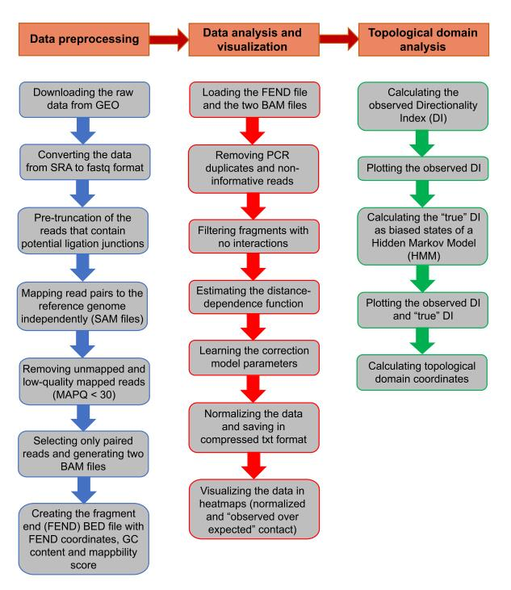
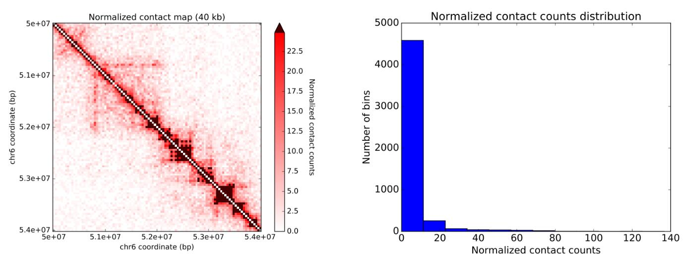
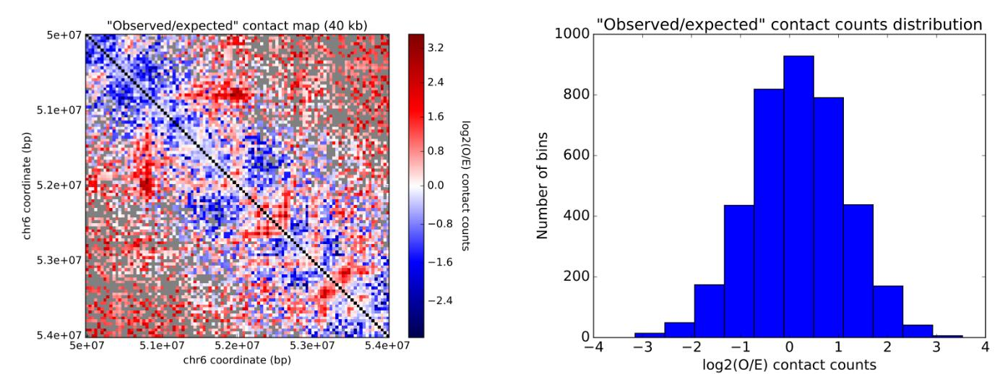

# GITAR Pipeline

## Introduction

> GITAR \(Genome Interaction Tools and Resources\), is a software to perform a comprehensive Hi-C data analysis, including data preprocessing, normalization, visualization and topologically associated domains \(TADs\) analysis. GITAR is composed of two main modules: 1\) HiCtool, a Python library to process and visualize Hi-C data, including TADs analysis and 2\) Processed data library, a large collection of human and mouse datasets processed using HiCtool.

## **HiCtool**

HiCtool is like a one-stop analysis tool which integrates all parts of hic analysis. It's aim is to enable users without any programming or bioinformatic expertise to work with Hi-C data and compare different datasets in a consistent way. 

HiCtool is a pipeline divided into three main sections:

* Data preprocessing
* Data analysis and visualization
* Topological domain analysis



### Installation


HiCtool is in a pipeline format to allow extreme flexibility and easy usage. **You do not need to install anything** besides the following [Python libraries](https://doc.genomegitar.org/overview.html#installation), packages and software. Everything is open source.


### Data preprocessing

* **1.** Downloading the source data from GEO.
* **2.** Pre-truncation of the reads that contain potential ligation junctions.
* **3.** Mapping read pairs to the reference genome.
* **4.** Filtering reads and selecting reads that are paired.
* **5.** Creating the fragment-end \(FEND\) bed file.



#### Downloading the source data from GEO

Full list of instructions [here](https://doc.genomegitar.org/preprocessing_data.html), key steps are captured below for your better understanding.

* The source data in sra format are downloaded via GEO accession number using the command **fastq-dump** of [SRA Toolkit](http://www.ncbi.nlm.nih.gov/Traces/sra/sra.cgi?view=toolkit_doc&f=fastq-dump).
* Split paired-reads SRA data into _SRRXXXXXXX\_1.fastq_ and _SRRXXXXXXX\_2.fastq_, and _SRRXXXXXXX.fastq_ \(if present\) contains reads with no mates.



#### Pre-truncation of the reads that contain potential ligation junctions

This step mainly pre-truncating ithe reads that contain potential ligation junctions to keep the longest piece without a junction sequence \([Ay et al., 2015](https://genomebiology.biomedcentral.com/articles/10.1186/s13059-015-0745-7)\). To do so download the code in [`pre_truncation.py`](https://doc.genomegitar.org/_downloads/pre_truncation.py) \(see [API Documentation](https://doc.genomegitar.org/preprocessing_data.html#api-documentation-preprocessing)\) to carry on. 

Full list of instructions [here](https://doc.genomegitar.org/preprocessing_data.html), key steps are captured below for your better understanding.

* pre\_truncate a .fastq file with different restriction enzyme \(**HindIII, MboI, NcoI and DpnII** sites were built in, while you can still add your own restriction sites file look up [here](https://doc.genomegitar.org/preprocessing_data.html). 
* Output with **.trunc.fastq** file as well as a log file contains the truncation information. 



#### Mapping read pairs to the reference genome

Full list of instructions [here](https://doc.genomegitar.org/preprocessing_data.html), key steps are captured below for your better understanding.

* Mapping software:  [Bowtie 2](http://bowtie-bio.sourceforge.net/bowtie2/index.shtml) —— reads are mapped independently. index is built with reference  **hg38.fa.**
* **HiCfile1\_log.txt** and **HiCfile2\_log.txt** are log files containing the statistics of the alignment.



 **Filtering reads and selecting reads that are paired**

Full list of instructions [here](https://doc.genomegitar.org/preprocessing_data.html), key steps are captured below for your better understanding.

* [SAMtools](http://samtools.sourceforge.net/) is used to extract the headers and perform filtering on the mapped reads \(quality\).
* Output paired SAM files \(HiCfile1\_hq.sam and HiCfile2\_hq.sam\) in **BAM format.**



#### Creating the fragment-end \(FEND\) bed file

The fragment-end \(FEND\) bed file is used to normalize the data and it contains restriction site coordinates and additional information related to fragment properties \(GC content and mappability score\). These properties will later be used in the normalization pipeline to remove biases.

*  GC content of 200 bp upstream and downstream to the restriction site is computed.
* The common RE sites were already precomputed:
  * [HindIII-hg38](http://data.genomegitar.org/HindIII_hg38_gc_map_valid.zip)
  * [MboI-hg38](http://data.genomegitar.org/MboI_hg38_gc_map_valid.zip) 
  * [NcoI-hg38](http://data.genomegitar.org/NcoI_hg38_gc_map_valid.zip)
  * [HindIII-mm10](http://data.genomegitar.org/HindIII_mm10_gc_map_valid.zip)
  * [MboI-mm10](http://data.genomegitar.org/MboI_mm10_gc_map_valid.zip)



### Data analysis and visualization

* **1.** Before normalization: HiFIVE:
  * Creating the Fend object.
  * Creating the HiCData object.
  * Creating the HiC project object.
  * Filtering HiC fends.
  * Estimating the HiC distance function.
  * Learning the correction model.
* **2.** Normalizing the data.
* **3.** Visualizing the data.



Before we do normalization, there are many unwanted effects people would like to exclude: Such as _PCR duplicates and non-informative reads, produced by the possibility of incomplete restriction enzyme digestion and fragment circularization._ 

Below we have a functional summary for each step,  details should refer to [here](https://doc.genomegitar.org/data_analysis_and_visualization.html). 

| Steps | Functions |
| :--- | :--- |
| 1.Creating the Fend object | Fend object Transform bed file to `FEND object` \(which containing RE information like coordinates, GC content and mappability score\). |
| 2.Creating the HiCData object             | Removing unwanted paired-reads \(like total distance to their respective restriction sites exceeds threshold, PCR duplicates, incomplete restriction enzyme digestion and fragment circularization\) |
| 3.Creating the HiC project object             | The `HiC project object` \(hdf5 format\) links the `HiCData object` with information about which fends to include in the analysis |
| 4.Filtering HiC fends | Filter out fragments that do not have at least one interaction before learning correction parameters. |
| 5.Estimating the HiC distance function                                      | Estimation of the **distance-dependence relationship** from the data prior to normalization.  Due to unevenly distributed restriction sites,  fragments surrounded by shorter ones will show higher nearby interactions than those with longer adjacent fragments |
| 6.Learning the correction model | Take into account of fragments length, inter-fragment distance, GC content and mappability score biases to learn the correction model for Hi-C data. \([Yaffe E. and Tanay A., 2011](http://www.ncbi.nlm.nih.gov/pubmed/22001755)\). In addition, biological biases are considered at this step \(TSSs and CTCF bound sites\). |


The script [`HiCtool_hifive.py`](https://doc.genomegitar.org/_downloads/HiCtool_hifive.py) can be used to run all the HiFive steps \(1-6\), whose outputs are **hdf5 files**. For more information about these functions, please see [HiFive’s API documentation](http://bxlab-hifive.readthedocs.org/en/latest/api.html). To run together steps 1-6, open the script [`HiCtool_hifive.py`](https://doc.genomegitar.org/_downloads/HiCtool_hifive.py), **update the parameters on the top and save**. Then just execute the script:



Biases are to remove at this step,  the observed contact matrix and the fend expected contact matrix are calculated. For each chromosome you can but not restricted to get these 6 files \([docs](https://doc.genomegitar.org/data_analysis_and_visualization.html)\): 

* The **observed data** contain the observed reads count for each bin.
* The **fend expected data** contain the learned correction value to remove biases related to fends for each bin.
* The **enrichment expected data** contain the expected reads count for each bin, considering the linear distance between read pairs and the learned correction parameters.
* The **normalized fend data** contain the corrected reads count for each bin.
* The **normalized enrichment data** \(“observed over expected” matrix\) contain the enrichment value \(O/E\) for each bin.



 This part is to plot the heatmap and histogram for the **normalized contact data** and **enrichment normalized contact matrix:**







### Topological domain analysis

A description can be found [here](https://doc.genomegitar.org/DI_calculation.html#), in this book we will talk about it in 3.2.3 TAD calling algorithms \(Combined DI\).

## Processed Data 

The processed data library is a collection of standardized [processed datasets](http://data.genomegitar.org) using **HiCtool**. There are 19 datasets of human \(hg38\), taken from the library on the [4D Nucleome \(4DN\) Web Portal](https://4dnucleome.org), and 2 datasets of mouse \(mm10\). Specifically, for GITAR we referred only to Hi-C derived datasets.

 **The results stored into zip files include:**

* Intrachromosomal contact matrices \(40 kb\)
* Directionality Index
* HMM states
* Topological domain coordinates
* HDF5 files

The downstream analysis can be carried out directly from these intermediate step like [here](https://www.genomegitar.org/processed-data.html). 

## Hands on example:

The cell line used here is B-lymphoblastoids GM12878 of human \(hg38\) with GEO accession number [GSM1551550](http://www.ncbi.nlm.nih.gov/geo/query/acc.cgi?acc=GSM1551550). To run the examples in this short tutorial you do not need the [entire list of  software/libraries](https://doc.genomegitar.org/overview.html#installation) but only the following:

* [numpy](http://scipy.org/)
* [scipy](http://scipy.org/)
* [matplotlib](http://matplotlib.org/)
* [math](https://docs.python.org/2/library/math.html)
* [hmmlearn](https://github.com/hmmlearn/hmmlearn)

To check if a module is installed, open your **python console** \(simply type `python` on your unix shell\) and try to import each module by typing:

```python
import my_module
```

If a module is not installed, go back to your **unix console** and type the following to install it:

```text
pip install my_module
```

All the modules should be already included into Python except for `hmmlearn`. To install `hmmlearn` download the package from GitHub \(link above\) then go inside the package folder and run the following on the **unix shell**:

```text
python setup.py install
```

### Data preprocessing

HiCtool provides a complete pipeline from the downloading of the raw data \(SRA format\) to the final BAM files that are used for the following analysis steps. In addition, instructions on how to generate a fragment end BED file to correct biases are provided.

Preprocessing steps:

1. Downloading the source data from GEO.
2. Pre-truncation of the reads that contain potential ligation junctions.
3. Mapping read pairs to the reference genome.
4. Filtering reads and selecting reads that are paired.
5. Creating the fragment-end \(FEND\) bed file.

**In this short tutorial we do not run any preprocessing step.** The following are the two BAM files and the FEND bed file produced as output of the preprocessing, to be used only if you want to proceed with the entire data normalization pipeline of the [full documentation](https://doc.genomegitar.org/data_analysis_and_visualization.html):

* [BAM file pair 1](https://sysbio.ucsd.edu/public/rcalandrelli/hictool_example/HiCfile_pair1.bam)
* [BAM file pair 2](https://sysbio.ucsd.edu/public/rcalandrelli/hictool_example/HiCfile_pair2.bam)
* [FEND bed file](https://sysbio.ucsd.edu/public/rcalandrelli/hictool_example/MboI_hg38_gc_map_valid.zip)

Download the data using `wget` followed by the link address of each file.

### Data analysis and visualization

The data analysis and visualization section provides the pipeline to normalize the data and plot the heatmaps. The normalization is done using the Python package [HiFive](http://bxlab-hifive.readthedocs.org/en/latest/introduction.html) while for plotting Matplotlib is used, with the possibility also to add a histogram of the distribution of the data. Observed, expected and normalized \(FEND\) contact counts can be plotted. FEND stands for "fragment end" and it refers to data corrected of technical and biological biases. In addition, we provide the possibility of plotting “observed over expected” \(enrichment\) contact heatmaps, where the expected counts are calculated considering both the learned correction parameters for biases and the distance between read pairs, given the property that the average intrachromosomal contact probability for pairs of loci decreases monotonically with increasing of their linear genomic distance.

Data analysis and visualization steps:

1. Creating the Fend object.
2. Creating the HiCData object.
3. Creating the HiC project object.
4. Filtering HiC fends.
5. Estimating the HiC distance function.
6. Learning the correction model.
7. Normalizing the data.
8. **Visualizing the data** \(reported here\).

Here for simplicity and processing time, we show examples only on visualization of the data \(step 8\).  
After the data are normalized \(step 7\), if both FEND and enrichment data were calculated, these files will be outputed \(here only for chromosome 6, at 1 mb and 40 kb resolution\):

* [Observed data chr 6 \(1 mb\)](https://sysbio.ucsd.edu/public/rcalandrelli/hictool_example/HiCtool_chr6_1mb_observed.txt)
* [Normalized fend data chr 6 \(1 mb\)](https://sysbio.ucsd.edu/public/rcalandrelli/hictool_example/HiCtool_chr6_1mb_normalized_fend.txt)
* [Observed data chr 6 \(40 kb\)](https://sysbio.ucsd.edu/public/rcalandrelli/hictool_example/HiCtool_chr6_40kb_observed.txt)
* [Normalized fend data chr 6 \(40 kb\)](https://sysbio.ucsd.edu/public/rcalandrelli/hictool_example/HiCtool_chr6_40kb_normalized_fend.txt)
* [Normalized enrichment data chr 6 \(40 kb\)](https://sysbio.ucsd.edu/public/rcalandrelli/hictool_example/HiCtool_chr6_40kb_normalized_enrich.txt)

To download the data use the command `wget` on the **unix shell** and copy the url link from each file above, here an example for the normalized fend data of chr 6 \(40 kb\):

```text
wget https://sysbio.ucsd.edu/public/rcalandrelli/hictool_example/HiCtool_chr6_40kb_normalized_fend.txt
```

Then download the Python script [HiCtool\_normalization\_visualization.py](https://sysbio.ucsd.edu/public/rcalandrelli/hictool_example/HiCtool_normalization_visualization.py):

```text
wget https://sysbio.ucsd.edu/public/rcalandrelli/hictool_example/HiCtool_normalization_visualization.py
```

Open a Python console on the **unix shell** \(by simply typing `python`\) and then execute the script on the **Python console**:

```python
execfile("HiCtool_normalization_visualization.py")
```

Plot the normalized fend data for chromosome 6 at 40 kb resolution:

```python
plot_chromosome_data('HiCtool_chr6_40kb_normalized_fend.txt', a_chr='6', bin_size=40000, full_matrix=False, start_coord=50000000, end_coord=54000000, species='hg38', data_type="normalized_fend", my_colormap=['white', 'red'], cutoff_type='percentile', cutoff=95, max_color='#460000', plot_histogram=True)
```

 

 


Here we plot normalized fend data \(`data_type`\) of chromosome 6 \(`a_chr`\), from 50 Mb \(`start_coord`\) to 54 Mb \(`end_coord`\) at a bin size of 40 kb \(`bin_size`\), for species hg38 \(`species`\). We use a colormap \(`my_colormap`\) which goes from white \(no contacts\) to red \(maximum contact\) and we use a upper cut-off at the 95th percentile of the non-zero data \(`cutoff_type` and `cutoff`\) to enhance higher order chromatin structure such as topological domains on the heatmap. We assign to the bins over the cut-off a specific color \(`max_color`\) and also we choose to plot the distribution of the contact data as well on a separate file \(`plot_histogram`\).

The same can be done for the "observed over expected" \(enrichment\) data:

```python
plot_chromosome_enrich_data('HiCtool_chr6_40kb_normalized_enrich.txt', a_chr='6', bin_size=40000, full_matrix=False, start_coord=50000000, end_coord=54000000, species='hg38', plot_histogram=True)
```

 


Red pixels are loci where there are more contacts than expected, blue pixels less contacts than expected. Note that the scale is log2. Gray pixels are those where the observed contact counts are 0, therefore the log2 of the ratio "observed/expected" would be minus infinite.

Plot of the normalized fend data at 1 mb resolution:

```python
plot_chromosome_data('HiCtool_chr6_1mb_normalized_fend.txt', a_chr='6', bin_size=1000000, full_matrix=True, species='hg38', data_type="normalized_fend", my_colormap=['white', 'blue'], cutoff_type='percentile', cutoff=95, max_color='#460000', plot_histogram=True)
```

 


In this case we plot the entire contact matrix \(`full_matrix=True`\) and we changed the maximum color of the heatmap to blue \(`my_colormap`\).

### Topological domain analysis

The topological domain analysis section provides the code to calculate both the observed DI \(Directionality Index\) and the “true DI” using a Hidden Markov Model. Also the code to calculate topological domain coordinates is provided, therefore the user can infer systematically about the location of topological domain and boundaries over the genome.

To calculate the DI, normalized fend data at 40 kb resolution are used \(see the [full documentation](https://doc.genomegitar.org/DI_calculation.html) for more details\).

First, download the script from the **unix shell**:

```text
wget https://sysbio.ucsd.edu/public/rcalandrelli/hictool_example/HiCtool_DI.py
```

Then, execute the script in the **Python console**:

```python
execfile("HiCtool_DI.py")
```

To calculate the DI values and save them to file run:

```python
DI = calculate_chromosome_DI(input_contact_matrix='HiCtool_chr6_40kb_normalized_fend.txt', a_chr='6')
```

The DI values are used as emissions in a Hidden Markov Model \(HMM\) to calculate the true DI values as HMM biased states:

```python
true_DI = calculate_chromosome_true_DI(input_file_DI='HiCtool_chr6_DI.txt', a_chr='6')
```

Now we can plot the DI and true DI values:

```python
plot_chromosome_DI(input_file_DI='HiCtool_chr6_DI.txt', a_chr='6', start_pos=50000000, end_pos=54000000, input_file_hmm='HiCtool_chr6_hmm_states.txt', species='hg38', plot_legend=True, plot_grid=True)
```


The true DI values allow to infer the locations of the topological domains in the genome. A domain is initiated at the beginning of a single downstream biased HMM state \(red color in the above figure\). The domain is continuous throughout any consecutive downstream biased state. The domain will then end when the last in a series of upstream biased states \(green color in the above figure\) is reached, with the domain ending at the end of the last HMM upstream biased state.

To calculate the topological domain coordinates run:

```python
topological_domains = calculate_chromosome_topological_domains(input_file_hmm='HiCtool_chr6_hmm_states.txt', a_chr='6')
```

Start and end coordinates will be saved in a [tab separated format file](https://sysbio.ucsd.edu/public/rcalandrelli/hictool_example/HiCtool_chr6_topological_domains.txt) where each line corresponds to a topological domain. Domain coordinates for the window \(50-54 Mb\) of the plot above are:

```text
50080000    50600000
50640000    51760000
51840000    52000000
52080000    52680000
52800000    53040000
53120000    53760000
```

## Reference:

R Calandrelli et, al. [GITAR: An open source tool for analysis and visualization of Hi-C data ](https://www.biorxiv.org/content/early/2018/05/08/259515.)


