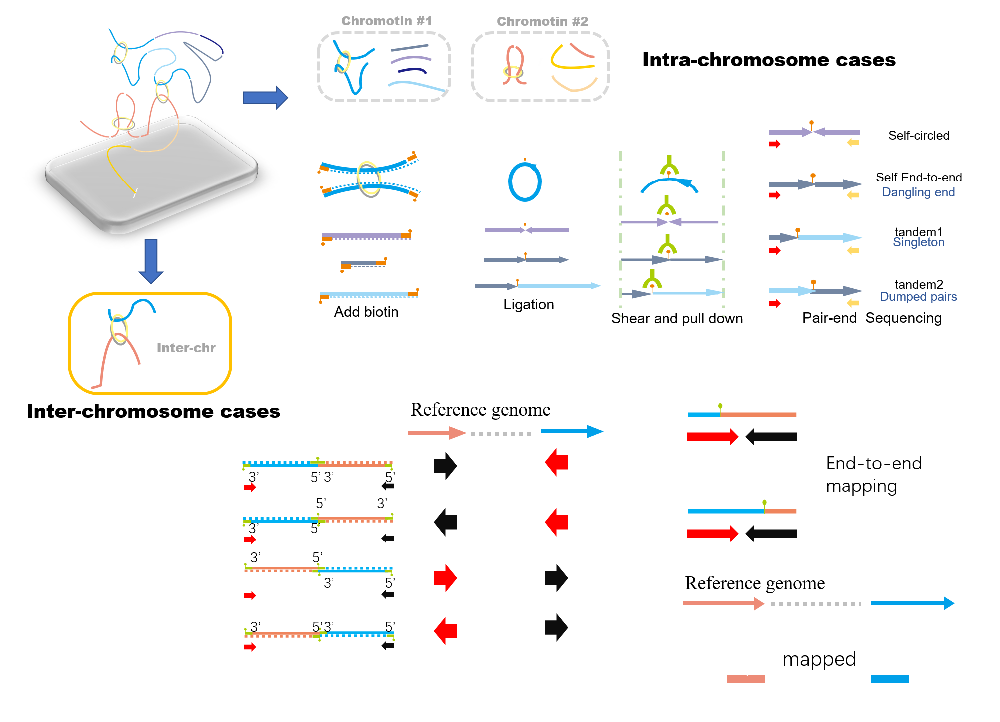

# 3.2.1 Read mapping consideration

## Reads mapping consideration

In the context of Hi-C methods which are not based on restriction enzyme digestion, no filtering of restriction fragments is applied. The uniquely mapped read pairs are directly used to build the contact maps. However, during the process of ligation \(with blunt ends\) and sonication one may get many kinds of artifacts are can be uniquely mapped to the genome, but doesn't make any sense. So we would like to dive deep into how these unwanted fragments come from. 

{% embed data="{\"url\":\"https://www.youtube.com/embed/6XNdbuALqOs\",\"type\":\"video\",\"title\":\"hi-c experimental process and artefacts consideration\",\"description\":\"In the context of Hi-C methods which are not based on restriction enzyme digestion, no filtering of restriction fragments is applied. The uniquely mapped read pairs are directly used to build the contact maps. However, during the process of ligation \(with blunt ends\) and sonication one may get many kinds of artifacts are can be uniquely mapped to the genome, but doesn\'t make any sense. So we would like to dive deep into how these unwanted fragments come from.\",\"icon\":{\"type\":\"icon\",\"url\":\"https://www.youtube.com/yts/img/favicon\_144-vfliLAfaB.png\",\"width\":144,\"height\":144,\"aspectRatio\":1},\"thumbnail\":{\"type\":\"thumbnail\",\"url\":\"https://i.ytimg.com/vi/6XNdbuALqOs/maxresdefault.jpg\",\"width\":1280,\"height\":720,\"aspectRatio\":0.5625},\"embed\":{\"type\":\"player\",\"url\":\"https://www.youtube.com/embed/6XNdbuALqOs?rel=0&showinfo=0\",\"html\":\"
<iframe src=\\\"https://www.youtube.com/embed/6XNdbuALqOs?rel=0&amp;showinfo=0\\\" style=\\\"border: 0; top: 0; left: 0; width: 100%; height: 100%; position: absolute;\\\" allowfullscreen scrolling=\\\"no\\\"></iframe>
\",\"aspectRatio\":1.7778}}" %}

