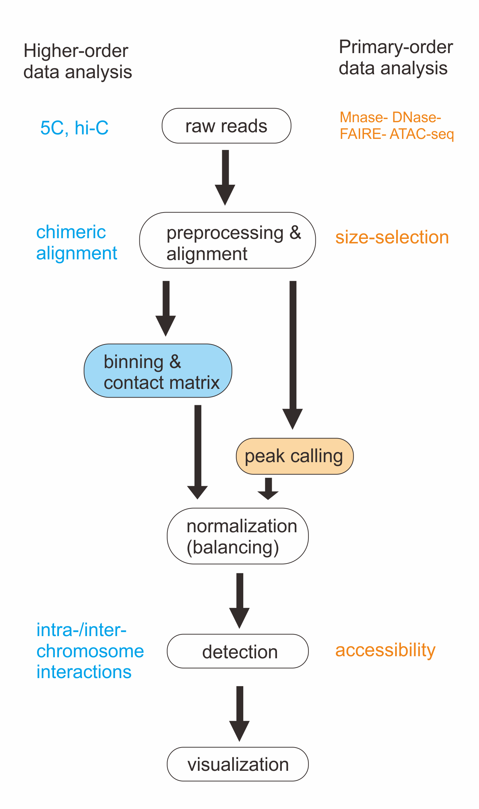

# Chap3 Computational analysis

## Computational analysis

Figure 1: Data analysis workflow comparison between higher-order data and primary-order data. The white box indicates common steps in the middle, and special analysis for different types are listed on two sides.

